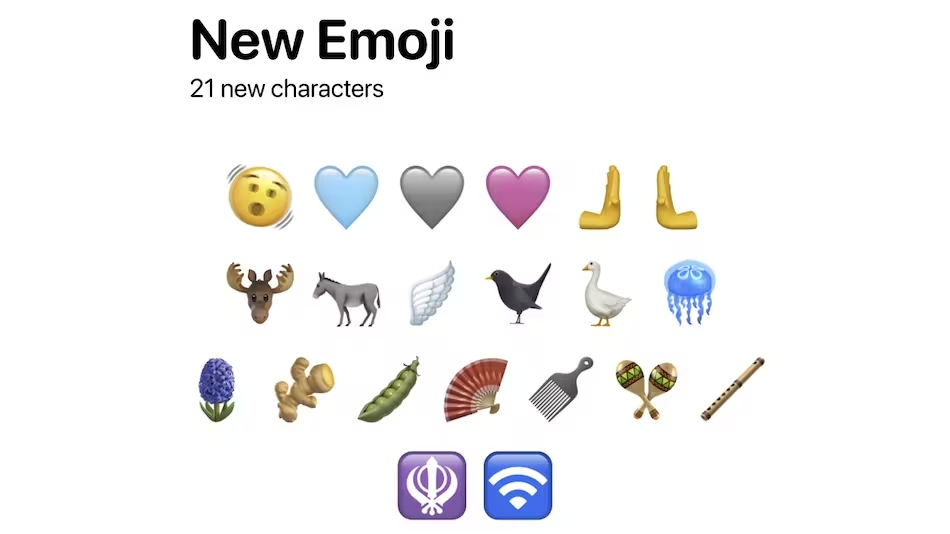

	
	  
	<h1 align="center">
		🍏 Apple Color Emoji Font 🔣
		

		
		
		
		
		
	</h1>
	<h2 align="center"><b>❗ UNOFFICIAL</b><i>, but original</i></h2>

## ⌛ Last Updates

### 🟢 Version 1 (07.07.2023)
  - Unicode version `15`
  - Apple Color Emoji Font version `16.4`
    #### ⚠️ Issues
    - Fonts __woff2__ and __svg__ not working
    - Fonts are not optimized

 

## ⚖️ Rights
### ‼️ All fonts are owned by [Apple](https://www.apple.com/) and [Unicode](https://home.unicode.org/).
### 🛑 The use of fonts is allowed for informational purposes only.
